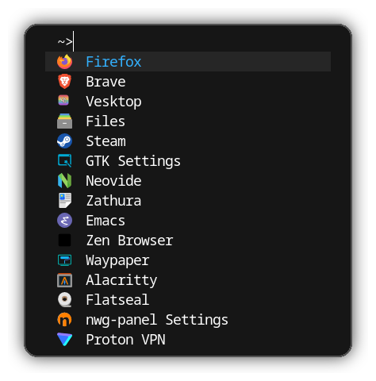
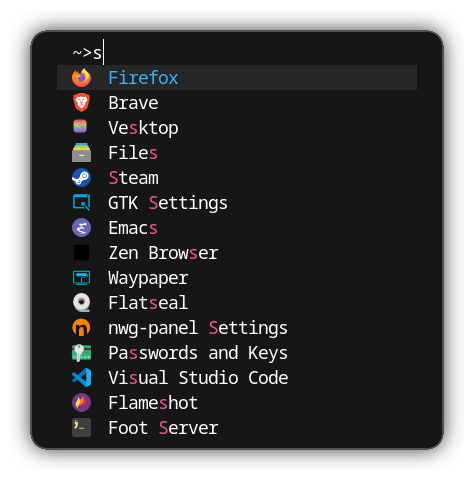

  
# oxocarbon-fuzzel

oxocarbon-fuzzel is a sleek and modern color scheme for fuzzel inspired by IBM's Carbon design system and the popular [`oxocarbon`](https://github.com/nyoom-engineering/base16-oxocarbon) color palette.

## Showcase

  

  

## Install 
Replace the current color definitions in your [`fuzzel.ini`](https://codeberg.org/dnkl/fuzzel/raw/branch/master/doc/fuzzel.ini.5.scd) configuration file 
with the content from the [`oxocarbon-dark.ini`](https://github.com/kuripa/oxocarbon-fuzzel/blob/master/output/oxocarbon-dark.ini) file located in the `output/` directory.

## Contributing
Contributions are welcome! Feel free to fork the repository, create new color variants, or suggest improvements. Thank you!
